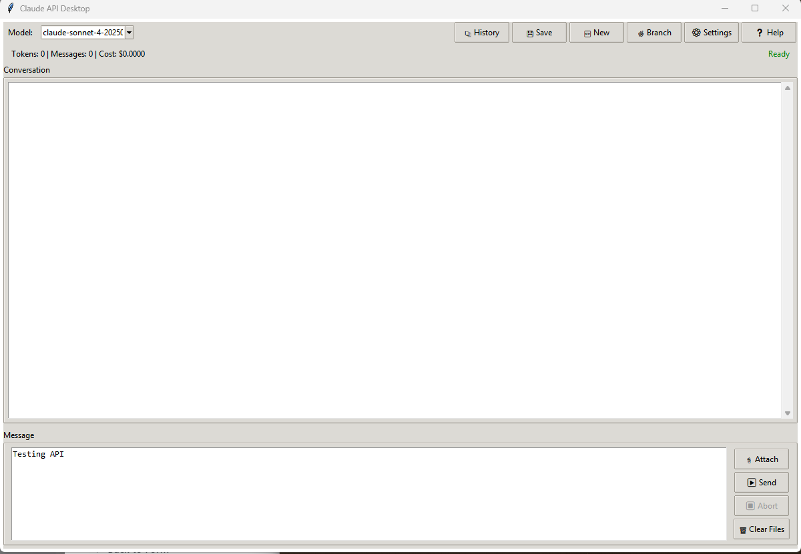

<p align="center">
  
</p>

<p align="center">
  <a href="mailto:anthony21@gmail.com"></a>
  <a href="https://linkedin.com/in/anthonymaio"></a>
  <a href="https://github.com/anthony-maio"></a>
</p>

---

## About Me

I'm a **Lead Software Engineer** and **Cloud Architect** with a passion for building scalable, intelligent systems. My work sits at the intersection of **cloud infrastructure**, **AI integration**, and **modern software architecture**.

I believe in writing clean, maintainable code and designing systems that are both powerful and elegant. Whether it's architecting microservices at scale or experimenting with cutting-edge AI APIs, I'm always exploring new ways to solve complex problems.

---

## Current Focus & Research

```
> Exploring the frontiers of AI-augmented development
```

- **AI Integration & APIs** - Building tools and workflows that leverage large language models, including hands-on work with Claude API and other AI platforms
- **Cloud Architecture** - Designing resilient, cost-effective infrastructure on major cloud platforms
- **Developer Experience** - Creating tools that enhance productivity and streamline development workflows
- **Systems Design** - Architecting solutions that balance performance, scalability, and maintainability

---

## Technical Expertise

<table>
<tr>
<td valign="top" width="33%">

### Cloud & Infrastructure


</td>
<td valign="top" width="33%">

### Languages & Frameworks


</td>
<td valign="top" width="33%">

### AI & Data


</td>
</tr>
</table>

---

## Featured Project

### Claude API Desktop (CAD)
A desktop application for interacting with the Claude API, featuring conversation management, history tracking, and a clean, intuitive interface.

<p align="center">
  
</p>

**Key Features:**
- Conversation history with save/load/branch capabilities
- Real-time token and cost tracking
- Support for multiple Claude models
- Auto-save with configurable intervals

---

## GitHub Activity

<p align="center">
  
</p>

---

## Let's Connect

I'm always interested in discussing:
- Cloud architecture challenges and solutions
- AI integration strategies for enterprise applications
- Open source collaboration opportunities
- New and emerging technologies

**Open to opportunities** - If you're looking for a Lead Engineer or Cloud Architect who brings both technical depth and leadership experience, let's talk.

<p align="center">
  
</p>

---

<p align="center">
  <i>"Building the future, one commit at a time."</i>
</p>
